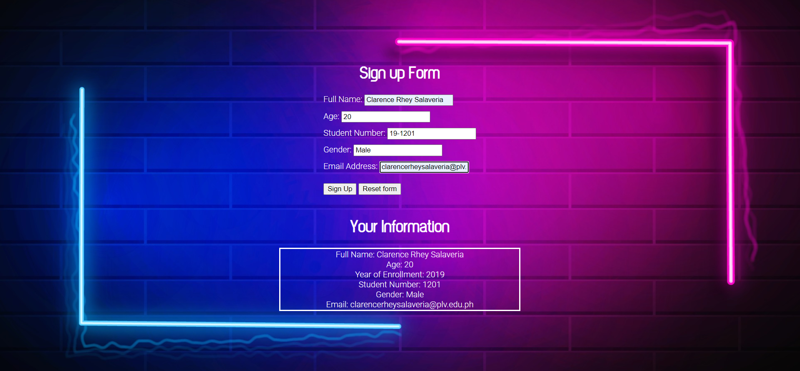

# CC6 Laboratory Activity 1

Sample Web Application using JavaScript, HTML, and CSS.

## Goals

- Use `console.log()`
- Use `alert()` in code
- Utilize `innerHTML` attribute of elements
- Get and store elements by their id

## Screenshot

